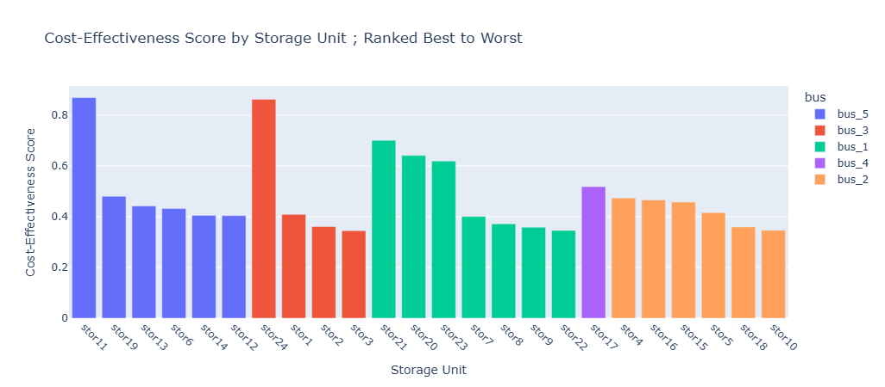
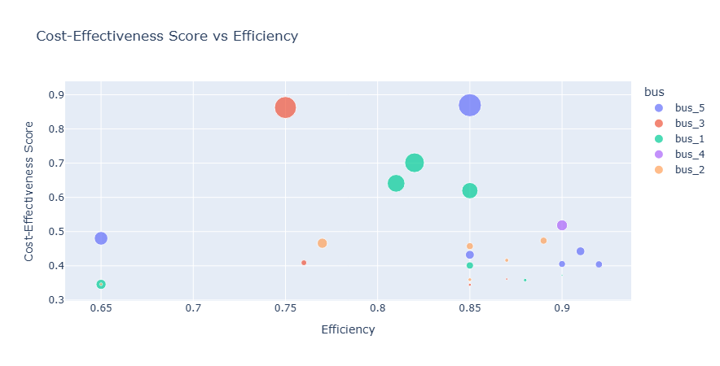
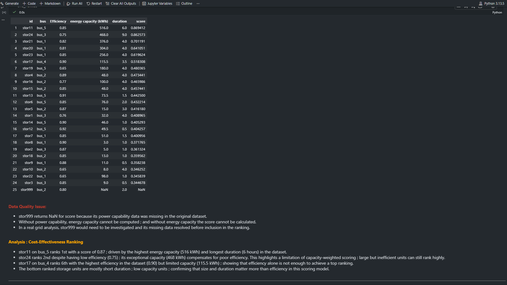

<a name="readme-top"></a>

# 📗 Table of Contents

- [📖 About the Project](#about-project)
  - [🛠 Built With](#built-with)
  - [Key Features](#key-features)
  - [📊 Sample Outputs](#sample-outputs)
- [💻 Getting Started](#getting-started)
  - [Prerequisites](#prerequisites)
  - [Setup](#setup)
  - [Install](#install)
  - [Usage](#usage)
- [👥 Authors](#authors)
- [🔭 Future Features](#future-features)
- [🙏 Acknowledgements](#acknowledgements)
- [📝 License](#license)

---

# 📖 Energy Storage Analytics <a name="about-project"></a>

> A Python data analysis project exploring the technical characteristics 
> of 25 battery storage units connected across a 5-bus power grid.

This project loads, merges, analyses and visualises real-world-style 
storage data. It computes key metrics including energy capacity, filters 
and summarises data using pandas, builds interactive visualisations using 
Plotly, and ranks storage units using a weighted cost-effectiveness 
scoring model.

**Key formula:** 

```Energy Capacity (kWh) = Power Capability (kW) × Duration (hours) ```

## 🛠 Built With <a name="built-with"></a>

### Tech Stack

- **Language:** Python 3.13
- **Libraries:** pandas, matplotlib, plotly, openpyxl
- **Environment:** Jupyter Notebook (VS Code)

### Key Features <a name="key-features"></a>

- **Data merging** : combines two datasets using pandas `.map()` 
  (Python equivalent of Excel VLOOKUP)
- **Energy capacity computation** : calculates capacity for all 25 storage units
- **Conditional filtering** : replicates Excel SUMIFS and AVERAGEIFS 
  using pandas boolean filtering
- **Interactive visualisations** : Plotly charts with hover tooltips 
  and legend interactivity
- **Cost-effectiveness scoring** : weighted ranking model combining 
  efficiency, capacity and duration
- **Data quality analysis** : identifies and fixes inconsistencies 
  in the original dataset

<p align="right">(<a href="#readme-top">back to top</a>)</p>

---

## 📊 Sample Outputs <a name="sample-outputs"></a>







<p align="right">(<a href="#readme-top">back to top</a>)</p>

---

## 💻 Getting Started <a name="getting-started"></a>

### Prerequisites

- Python 3.x installed on your machine
- VS Code with the Jupyter extension installed

### Setup

Clone this repository:
```sh
git clone https://github.com/NATASHA-ct/energy-storage-analytics.git
cd energy-storage-analytics
```

### Install

Install all dependencies:
```sh
pip install -r requirements.txt
```

### Usage

All notebooks are in the `notebooks/` folder. Open and run in order:

| Notebook | Description |
|---|---|
| 01_load_merge_analyse.ipynb | Load, merge and analyse storage unit data |
| 02_sumifs_averageifs.ipynb | Filter and summarise data using pandas |
| 03_interactive_charts.ipynb | Interactive visualisations with Plotly |
| 04_cost_effectiveness.ipynb | Cost-effectiveness scoring per storage unit |

Run all cells from top to bottom using **Run All**.

<p align="right">(<a href="#readme-top">back to top</a>)</p>

---

## 👥 Authors <a name="authors"></a>

👤 **Natasha Chirombe**

- GitHub: [@NATASHA-ct](https://github.com/NATASHA-ct)
- LinkedIn: [Natasha Chirombe](https://www.linkedin.com/in/natashatatendachirombe/)

<p align="right">(<a href="#readme-top">back to top</a>)</p>

---

## 🔭 Future Features <a name="future-features"></a>

- [ ] Incorporate real capital cost data (£/kWh) into the scoring model
- [ ] Build a Streamlit dashboard with adjustable scoring weights
- [ ] Apply scoring methodology to a larger real-world grid dataset

<p align="right">(<a href="#readme-top">back to top</a>)</p>

---

## 🙏 Acknowledgements <a name="acknowledgements"></a>

- **Dr. Spyros Giannelos** — Imperial College London for the real storage data.

<p align="right">(<a href="#readme-top">back to top</a>)</p>

---

## 📝 License <a name="license"></a>

This project is [MIT](./LICENSE) licensed.

<p align="right">(<a href="#readme-top">back to top</a>)</p>